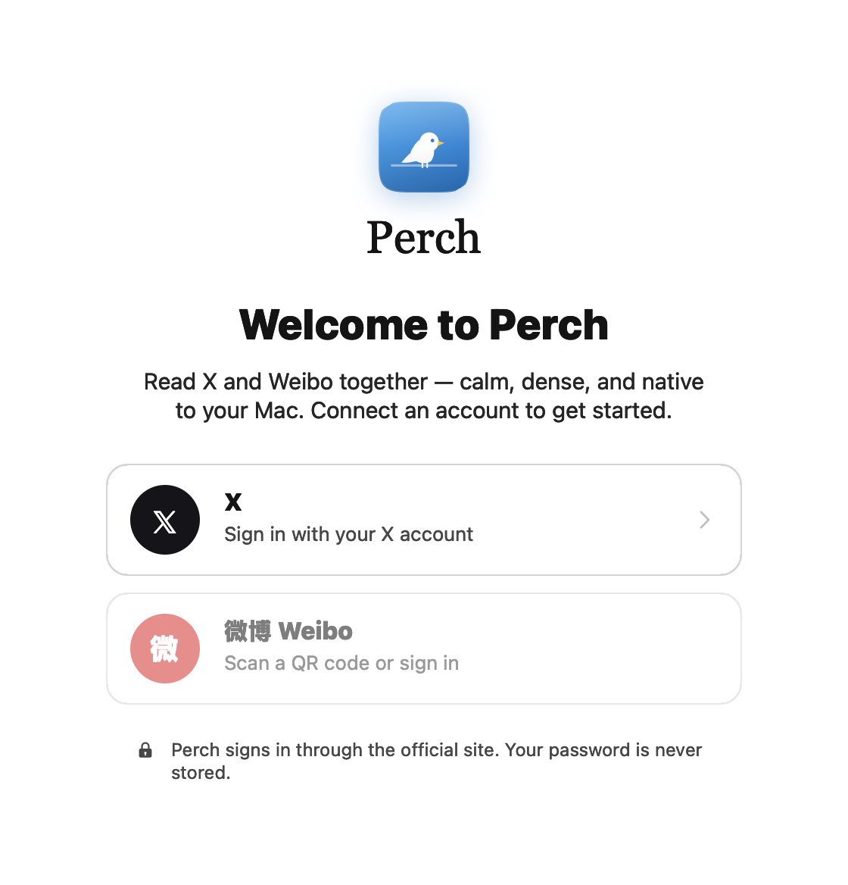
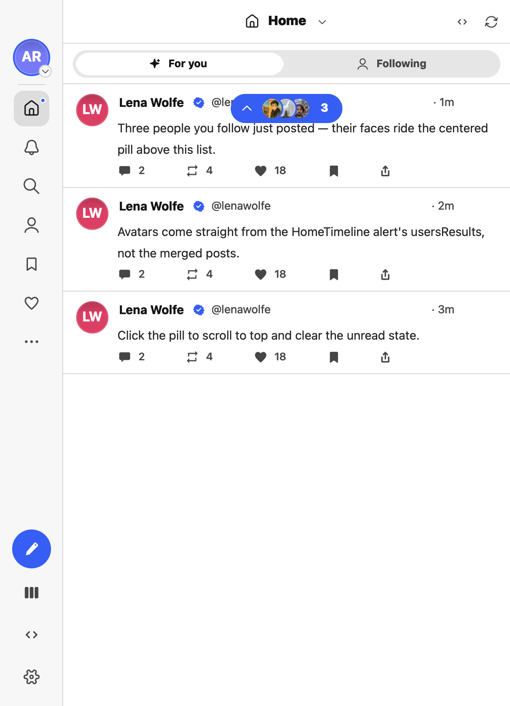
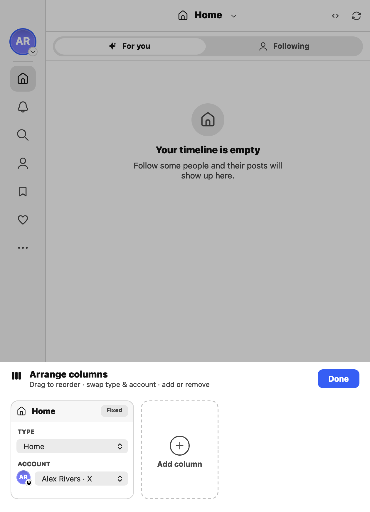
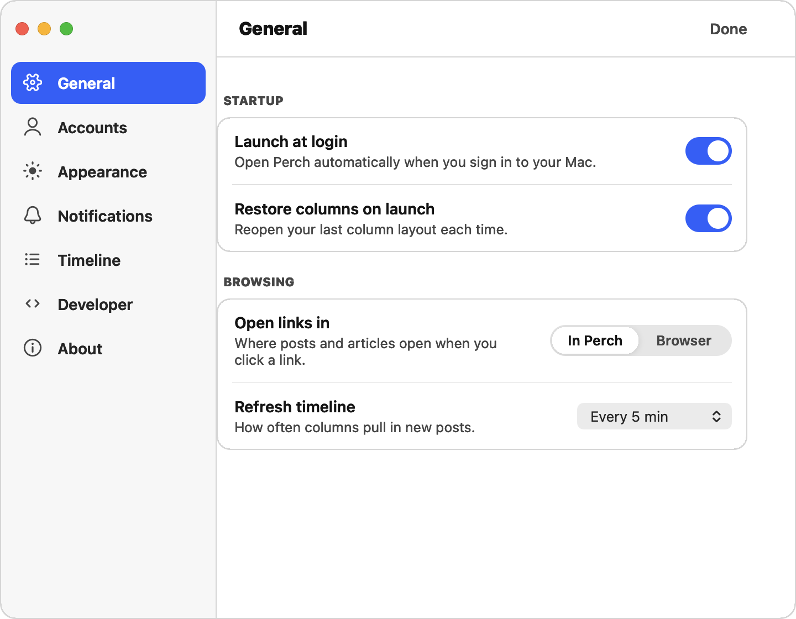

# Perch

> Read X and Weibo together — calm, dense, and native to your Mac.

[](https://www.apple.com/macos/)
[](https://swift.org)
[](https://developer.apple.com/documentation/appkit)
[](https://www.swift.org/package-manager/)

**Perch** is a native macOS app that renders a multi-column X/Twitter timeline reader — a calm, information-dense alternative to the web client, built entirely in AppKit. Login and reads/writes run **live** against X using cookie auth. Weibo support is UI-only for now ("Coming soon").

<p align="center">
  
</p>

## Screenshots

| Multi-column timeline | Thread & quotes |
| --- | --- |
|  |  |

| Arrange columns | Settings |
| --- | --- |
|  |  |

## Features

- **Multi-column canvas** — a horizontally scrolling deck of resizable columns (Home, Notifications, Search, Profile, Bookmarks, Likes), arranged from an icon rail.
- **Live X integration** — real timeline, post detail, profiles, replies, and notifications over X's GraphQL API; like / repost / bookmark / follow with optimistic updates that sync in the background.
- **Compose & reply** — post and reply with media (images, GIF, video), polls, and reply-scope control. Posting is live.
- **Notification center** — the bell column is a full notification center with filters (all, verified, @mentions), not a plain mentions list.
- **Media viewer** — full-screen images and a custom video player with autoplay coordination.
- **Threads & quotes** — nested reply trees and quote-tweet cards rendered inline.
- **"New posts" pill** — a centered pill that surfaces fresh posts with the avatars of people you follow.
- **Theming** — light / dark / system, plus a palette of accent colors.
- **Multi-account** — connect more than one X account and switch between them from the rail.
- **Secure web login** — sign-in runs through X's official web flow in a `WKWebView`; your password is never sent to or stored by Perch. Only session cookies are kept, in the macOS Keychain.
- **Developer inspector** — a built-in JSON/network inspector (the `<>` toolbar button) for examining live API responses.

The entire UI is a pixel-for-pixel recreation of an HTML/CSS/JS design prototype (see [`design/`](design/)), implemented in hand-laid-out AppKit — no SwiftUI, no Auto Layout.

## Requirements

- macOS 13 (Ventura) or later
- Swift 5.9+ toolchain (Xcode 15+ or a matching Swift command-line toolchain)
- An X account (for the live timeline; the UI runs without one but feeds stay empty)

## Build & run

```bash
swift build                 # debug build
swift build -c release      # release build
swift run                   # build and launch
swift test                  # run the unit tests
.build/debug/Perch          # run an existing debug build
```

### Codesigning for live login

The live login flow stores session cookies in the Keychain and authenticates inside a `WKWebView`. An unsigned binary may fail those operations, so the built executable should be codesigned. The quickest stand-in is an ad-hoc signature:

```bash
codesign --force --sign - .build/debug/Perch
```

For a stable signing identity across rebuilds (which keeps Keychain credentials reachable), sign with your own Developer ID / certificate and a consistent identifier.

> **Note:** `CLAUDE.md` references a `build.sh` helper that builds and codesigns in one step. That script is not yet checked into the repository — use the commands above in the meantime.

## Debug snapshots

The app can launch into a specific UI state, screenshot it to PNG, and quit — handy for verifying layout without credentials or manual clicking. The screenshots in this README were generated this way.

```bash
# Render the welcome screen to a PNG and quit
PERCH_STATE=welcome PERCH_SNAPSHOT=/tmp/out.png .build/debug/Perch

# Force light theme
PERCH_THEME=light PERCH_SNAPSHOT=/tmp/out.png .build/debug/Perch

# Export the app icon to a PNG and quit
PERCH_ICON_PNG=/tmp/icon.png .build/debug/Perch
```

`PERCH_STATE` accepts states such as `welcome`, `compose`, `tray`, `detail`, `profile`, `reply`, `notif`, `settings`, `addaccount`, `xlogin`, `mediaimages`, `mediavideo`, `newposts`, and more (see `RootViewController.debugApply`). Snapshots skip session restore so they render deterministically; states that reference live tweet IDs degrade to stubs.

## Architecture

Perch keeps a single source of truth in `Core/AppState.swift` and re-renders through a delegate. The main surfaces:

- **`App.swift`** — `AppDelegate` owns one `NSWindow` and swaps its content between `WelcomeViewController` (onboarding) and `RootViewController` (the app). Compose, settings, add-account, and the media viewer are separate panel windows.
- **`RootViewController`** — icon rail + a scrolling canvas of `ColumnView`s + overlays (popovers, toast, column-manager tray). Implements `AppStateDelegate` and rebuilds the canvas in response to state changes.
- **`Core/`** — rendering and app primitives: `Theme`/`ThemeManager`, `GlyphView` (draws literal SVG paths from the design), `ImageLoader`, timeline stores, video coordinators.
- **`API/`** — a cookie-authed client for X's undocumented GraphQL endpoints (modeled on the Flare / `xqt` client). `TwitterService` is the coordinator to start from; `TwitterAPIClient` does the HTTP; `TwitterDataMapper` maps responses to Perch models.

State follows a few consistent conventions: optimistic writes layered over a local override dict, per-account live caches (`liveTimelines`, `liveColumns`, `liveProfiles`, …), and `MainActor` hops after every async fetch. For the full picture — including state flow, API fragility notes, and gotchas — read [`CLAUDE.md`](CLAUDE.md).

### Project layout

```
Sources/Perch/
  App.swift            # entry point, window + menu
  API/                 # live X client (GraphQL, auth, mapping, login webview)
  Core/                # AppState, Theme, glyphs, image/video, stores
  Components/          # reusable cells & controls (post, notif, media, action bar)
  Models/              # data model (Post, Person, Media, …)
  Screens/             # columns, compose, settings, media viewer, root VC
Tests/PerchTests/      # unit tests
design/                # HTML/CSS/JS design prototype (the visual source of truth)
docs/                  # supplementary docs + README images
```

## How login works

`AddAccountView` opens X's login page (`x.com/i/flow/login`) in a real `WKWebView`. Once both the `auth_token` and `ct0` cookies are present, Perch scrapes them, validates the session, and stores the credentials in the Keychain (service `com.perch.twitter`). On the next launch, `restoreSessions()` loads the saved cookies (this is skipped under `PERCH_SNAPSHOT` so snapshots render deterministically).

## Caveats

- **Unofficial client.** Perch talks to X's *undocumented* GraphQL and legacy REST endpoints. This layer is inherently fragile: query IDs, per-operation feature flags, and the transaction-id signature rotate with X's web bundles and can break without notice. Use at your own risk, and be mindful of X's Terms of Service.
- **Not affiliated** with X Corp., Twitter, or Sina Weibo.
- **Weibo is UI-only** today — the screens exist, but there is no live Weibo backend yet.
- **No password handling.** Perch never sees your password; it only reads session cookies after you log in through X's own web flow.

## Design source

The [`design/`](design/) directory is a handoff bundle of HTML/CSS/JS prototypes from [Claude Design](https://claude.ai/design). They are the visual source of truth — Perch recreates their output in AppKit rather than copying their internal structure. Glyphs are ported as literal SVG path data. See [`design/README.md`](design/README.md) for details.

## License

No license file is currently included, so the code is provided as-is with all rights reserved by default. Add a `LICENSE` if you intend to distribute or open-source it.
